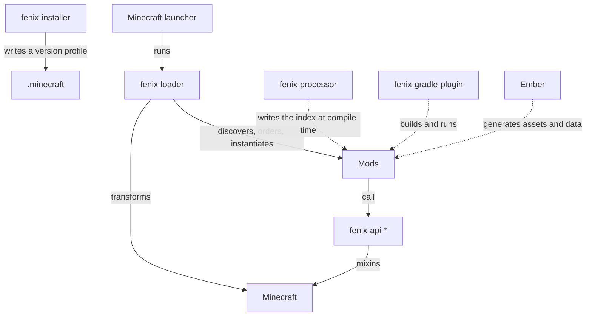

# Architecture

## The pieces



The loader is the only component that must exist for the game to start. Every
API module is an ordinary mod that happens to ship with Fenix.

## Launch sequence

1. The launcher starts `fenix-loader` instead of the game, using the version
   profile the installer wrote.
2. The loader locates the game jar, decides which side it is on, and scans the
   mods directory.
3. Each mod's `fenix.mod.json` is parsed, constraints are solved, and the mods
   are sorted into dependency order.
4. A child-first classloader is created with a transformation hook; mixins are
   registered into it.
5. Mods are instantiated from the compile-time index and receive
   `onPreLaunch(Fenix)`.
6. The game's main class runs. The loader's own mixins fire the later lifecycle
   phases from inside the game.

## Classloading

Fenix uses a **child-first** classloader: a class is resolved from the mod and
game jars before the application classpath. That is what allows the loader to
transform game classes at all.

Two prefixes are deliberately excluded and always resolve from the parent:

- `fr.d4emon.fenix.loader.*`
- `fr.d4emon.fenix.api.*`

**Why it matters:** the loader has to hold references to the types it uses to
talk to mods (`@Mod`, `FenixMod`, `Fenix`). If those types were also loadable by
the child, a mod would end up holding a *different* `Class` object with the same
name, and every cast between them would fail.

**The rule this creates:** mod code must never live under `fr.d4emon.fenix.api.`.
That is why the API slices use `fr.d4emon.fenix.event`, `fr.d4emon.fenix.registry`
and so on, while only `fenix-api-core` — which is a library, not a mod — uses
`fr.d4emon.fenix.api`.

A second consequence: **anything that runs as the game's main class must live in
a jar the loader loaded.** A datagen runner sitting on the application classpath
would resolve `net.minecraft.*` against the untransformed copy and silently
disagree with the game the player sees. This is why Ember ships as a mod.

## Package layout

| Module               | Package                     | Loaded by     |
|----------------------|-----------------------------|---------------|
| `fenix-loader`       | `fr.d4emon.fenix.loader`    | parent        |
| `fenix-api-core`     | `fr.d4emon.fenix.api`       | parent        |
| `fenix-api-event`    | `fr.d4emon.fenix.event`     | child (a mod) |
| `fenix-api-registry` | `fr.d4emon.fenix.registry`  | child (a mod) |
| `fenix-api-resource` | `fr.d4emon.fenix.resource`  | child (a mod) |
| `fenix-api-network`  | `fr.d4emon.fenix.network`   | child (a mod) |
| `fenix-api-command`  | `fr.d4emon.fenix.command`   | child (a mod) |
| `fenix-api-config`   | `fr.d4emon.fenix.config`    | child (a mod) |
| `fenix-api` (bundle) | `fr.d4emon.fenix`           | child (a mod) |
| `ember`              | `fr.d4emon.fenix.ember`     | child (a mod) |
| all mixins           | `fr.d4emon.fenix.mixin.*`   | child         |

## Sidedness

**A class that so much as mentions a `net.minecraft.client.*` type will throw
`NoClassDefFoundError` on a dedicated server** — resolution happens when the
class is loaded, not when the method is called.

So: anything touching a client type lives in a `.client` sub-package, and
common code reaches it only through a separate method guarded by a side check.
The guard has to be a *method boundary*, because an `if` in the same method
still forces the class to resolve.

This is worth an automated check in `testing/conformance` scanning the built
jars, because it is invisible until someone runs a server.

## Mixins

A mixin config declares exactly **one** package. Every Fenix mixin config
therefore namespaces itself under a shared root:

```
fr.d4emon.fenix.mixin.loader
fr.d4emon.fenix.mixin.event
fr.d4emon.fenix.mixin.registry
...
```

Picking `fr.d4emon.fenix` as the root instead would make Mixin treat the entire
loader and API as mixin classes.

There are no refmaps: Minecraft has shipped unobfuscated since 26.1, so mixins
target real names.

## Why the API is split

A mod that only listens for events should not carry the networking stack. Each
slice is independently publishable and independently versioned, and mods declare
only what they use.

`fenix-api` exists as an aggregate for people who want one dependency line; it
pulls every slice in transitively. The two options coexist deliberately — the
split is for mod authors who care, the bundle is for everyone else.

## Why the processor has no dependencies

`fenix-processor` runs inside the *mod author's* compiler. Anything it depends
on lands on their annotation processor path and can collide with their build.
So it matches annotations by fully qualified name and writes its index as
hand-rolled JSON.

The payoff is that a broken mod — abstract class, missing no-arg constructor, a
class that does not implement what it claims — fails at `javac`, with a line
number, instead of at launch.
